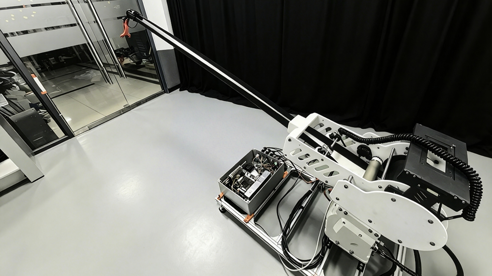

<!--  -->

# TapSpingRobot-robotArm

Open-source implementation for kinematics, control, simulation and modeling of robotic manipulators 

--- --- ---

    
 

<!-- 

<a href="#项目简介">简介</a> •
<a href="#核心功能">功能</a> •
<a href="#项目结构">结构</a> •<a href="#快速开始">快速开始</a> •<a href="#论文成果">论文</a> •<a href="#环境依赖">环境</a>

 -->

---

## 📖 Project Introduction / 项目简介
This repository contains the complete source code, models, simulation environments and experimental data corresponding to the author’s academic paper and master’s thesis. It focuses on robot arm modeling, motion planning, control algorithms and verification.

本仓库完整收录了作者**小论文**与**硕士学位论文**相关的全部代码、机械臂模型、仿真环境与实验数据，聚焦于机械臂建模、轨迹规划、控制算法与实验验证，同时具备学术价值与工程实用性。

---

## 🎯 Main Functions / 主要功能
Forward & inverse kinematics, trajectory planning, dynamic modeling, motion control, obstacle avoidance, robot simulation and experimental result visualization.

- 正/逆运动学求解
- 轨迹规划算法实现
- 动力学建模与参数辨识
- 运动控制与优化算法
- 避障与路径规划
- 机器人仿真环境搭建
- 实验曲线与结果可视化

---

## 📁 Project Structure / 项目结构
'
|--TapROT_26/
| |
| |-- BOM/ 
| |-- Installation Guide
| |-- paper/                 
| |-- Code/
| |-- TapSpingROT_Model/
| |-- TapSpingROT_STL/
| |-- TapSpingROT_URDF/
| |-- README.md
'

